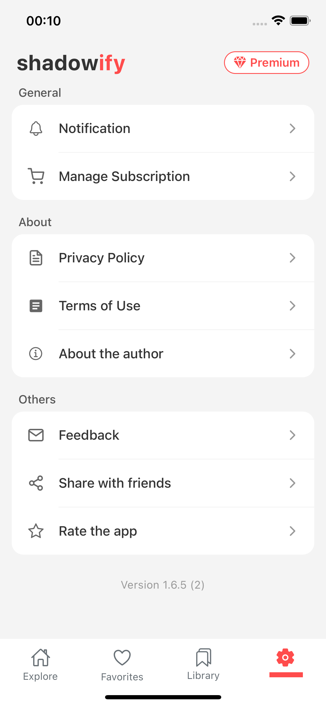
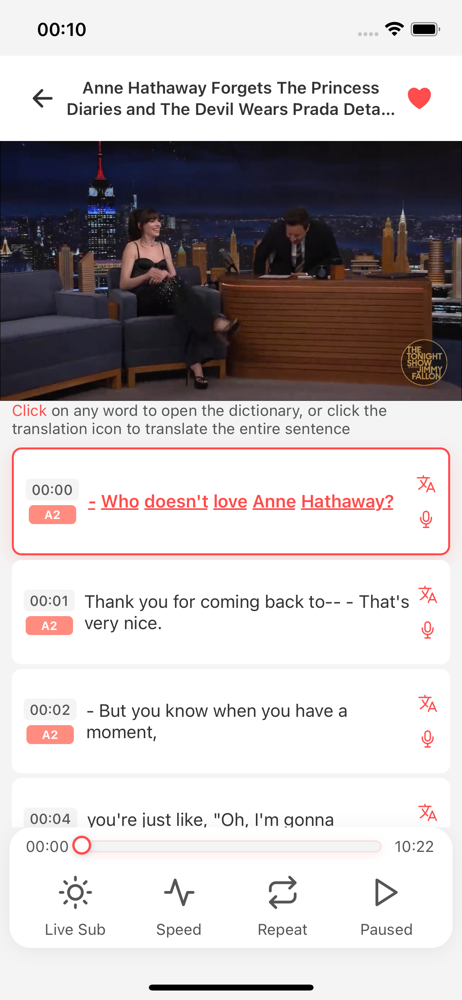

# Welcome to your Expo app 👋

This is an [Expo](https://expo.dev) project created with [`create-expo-app`](https://www.npmjs.com/package/create-expo-app).

<div align="center">
  
  <h1>Shadowify UI</h1>
  <p>A modern language learning app that helps improve speaking skills through video shadowing practice</p>
</div>

## Features

- 📱 **Modern UI**: Beautiful and intuitive React Native interface
- 🎥 **Video Shadowing**: Practice speaking along with videos to improve pronunciation
- 🎯 **Transcript Highlighting**: Follow along with highlighted transcript as you watch
- 🔍 **Dictionary Integration**: Look up definitions with just a tap
- ⏱️ **Speed Control**: Adjust video speed for better learning
- 🎙️ **Recording**: Record your own voice for comparison
- 💾 **Save & Favorite**: Save videos and mark favorites for later practice
- 🌐 **YouTube Integration**: Practice with videos from YouTube

## App Screenshots

Here are some screenshots of the Shadowify UI app:

<p align="center">
  
  &nbsp;&nbsp;&nbsp;
  
  &nbsp;&nbsp;&nbsp;
  
</p>

<p align="center">
  
  &nbsp;&nbsp;&nbsp;
  
  &nbsp;&nbsp;&nbsp;
  
</p>

<p align="center">
  
  &nbsp;&nbsp;&nbsp;
  
  &nbsp;&nbsp;&nbsp;
  
</p>

<p align="center">
  
  &nbsp;&nbsp;&nbsp;
  
  &nbsp;&nbsp;&nbsp;
  
</p>

## Get started

1. Install dependencies

   ```bash
   npm install
   ```

2. Start the app

   ```bash
   npx expo start
   ```

In the output, you'll find options to open the app in a

- [development build](https://docs.expo.dev/develop/development-builds/introduction/)
- [Android emulator](https://docs.expo.dev/workflow/android-studio-emulator/)
- [iOS simulator](https://docs.expo.dev/workflow/ios-simulator/)
- [Expo Go](https://expo.dev/go), a limited sandbox for trying out app development with Expo

You can start developing by editing the files inside the **app** directory. This project uses [file-based routing](https://docs.expo.dev/router/introduction).

## Get a fresh project

When you're ready, run:

```bash
npm run reset-project
```

This command will move the starter code to the **app-example** directory and create a blank **app** directory where you can start developing.

## Learn more

To learn more about developing your project with Expo, look at the following resources:

- [Expo documentation](https://docs.expo.dev/): Learn fundamentals, or go into advanced topics with our [guides](https://docs.expo.dev/guides).
- [Learn Expo tutorial](https://docs.expo.dev/tutorial/introduction/): Follow a step-by-step tutorial where you'll create a project that runs on Android, iOS, and the web.

## Join the community

Join our community of developers creating universal apps.

- [Expo on GitHub](https://github.com/expo/expo): View our open source platform and contribute.
- [Discord community](https://chat.expo.dev): Chat with Expo users and ask questions.
